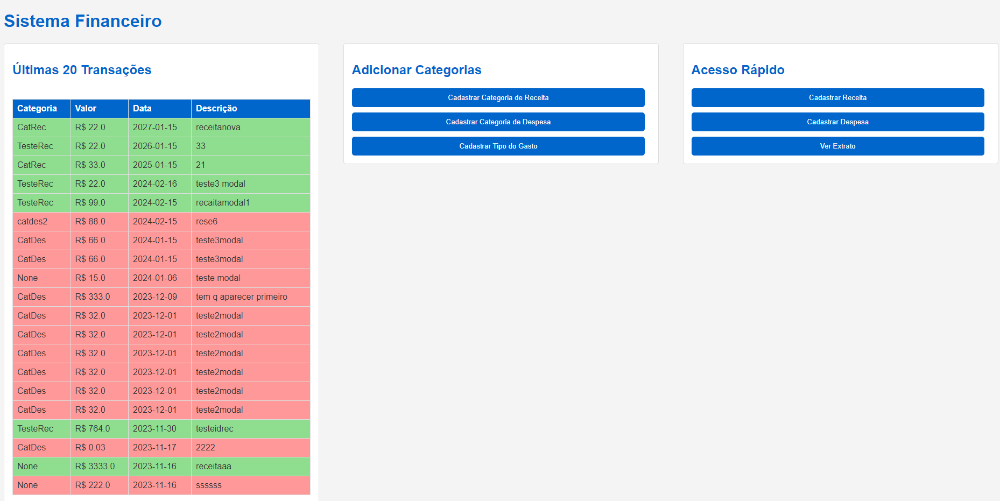
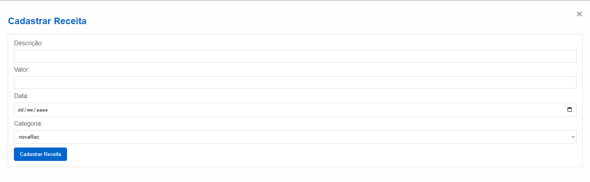

# Sistema-Financeiro-Pyhton
Sistema feito com python, json e js, intuito de cadastrar os dados de receitas e despesas, e gerar comparacao entre meses, facilitando a visualização das contas mensais e anuais

# Imagens do sistema

*Tela Inicial*

*Modal de transações*

# Instalação do sistema
Usando docker: "execute docker-compose up --build" na pasta principal, onde possui o arquivo docker-compose.yml
